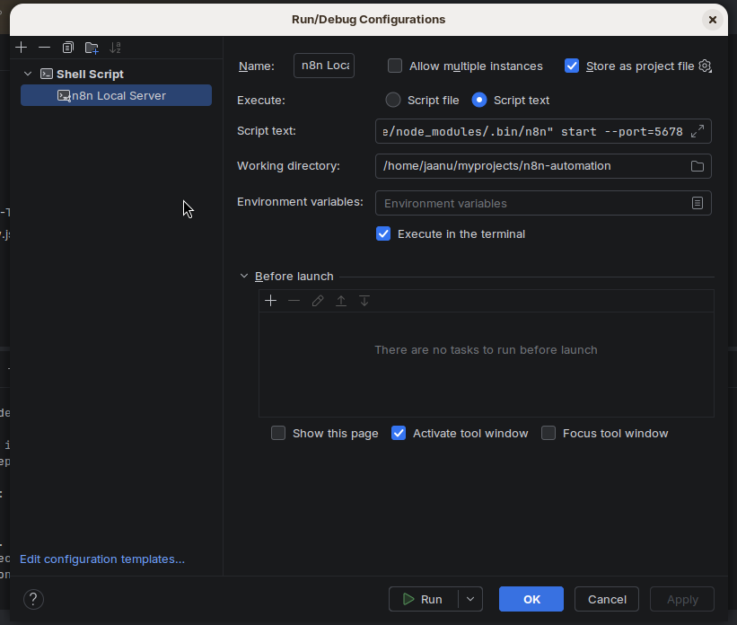
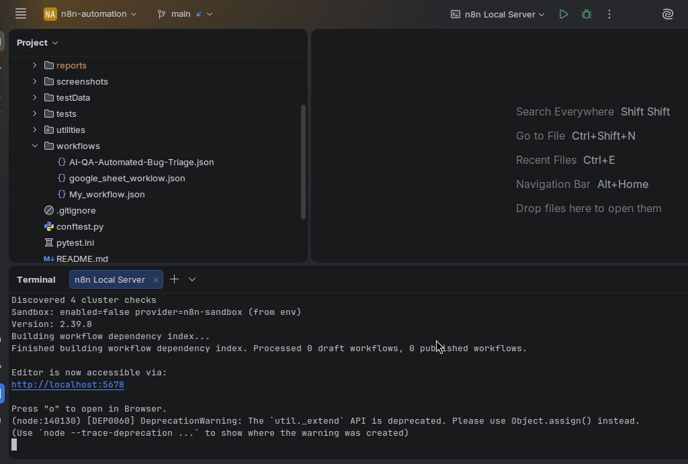
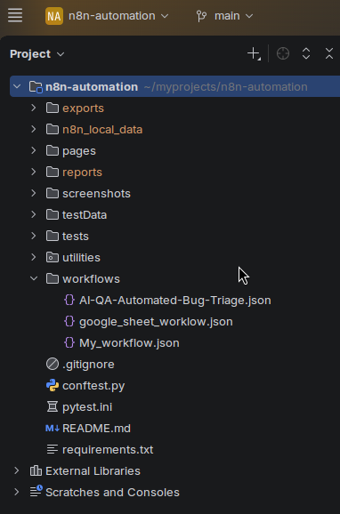

# n8n Workflow Automation

Practical n8n automation project demonstrating PyCharm integration, local n8n server execution, Playwright SauceDemo automation, AI-assisted email automation, and AI-QA bug triage.

## 1. PyCharm and n8n Integration

n8n is integrated with the PyCharm project as a local server.

The n8n runtime uses the `N8N_USER_FOLDER` environment variable and project-local n8n runtime data.

The PyCharm Run Configuration is used to start the local n8n server.

The local n8n server runs on:

```text
http://localhost:5678
```

The n8n interface can then be opened in the browser at the local server address.

### PyCharm and n8n Evidence







## 2. Three n8n Workflows

### Workflow 1: Playwright SauceDemo, n8n Webhook and Gemini

This workflow demonstrates the integration between the Playwright SauceDemo E2E test running from PyCharm and n8n.

The Playwright test executes the SauceDemo scenario and sends the test completion payload to the configured n8n webhook.

The n8n workflow receives the webhook request and processes it using a Basic LLM Chain and Google Gemini.

**Workflow:** [My Workflow](workflows/My_workflow.json)

#### SauceDemo Script Execution

The Playwright E2E test is executed from the PyCharm project:

```bash
pytest tests/test_E2EScenario.py -v
```

The SauceDemo test execution is verified in PyCharm.

The corresponding webhook and n8n workflow execution are verified in the n8n interface.

#### SauceDemo Execution Evidence


### Workflow 2: Google Sheets, Gmail and AI Agent

This workflow demonstrates AI-assisted automation using Google Sheets, Gmail, Google Gemini, and an AI Agent.

The workflow is executed directly from the n8n interface by providing a prompt message.

No PyCharm test script is required for this workflow.

**Workflow:** [Google Sheets Workflow](workflows/google_sheet_worklow.json)

#### Email Workflow Evidence


### Workflow 3: AI-QA Automated Bug Triage

This workflow demonstrates AI-assisted QA defect triage using an AI Agent, Ollama, Google Sheets, and Jira.

The workflow is executed directly from the n8n interface by providing a prompt message.

The workflow processes the QA defect information and creates the corresponding Jira issue.

No PyCharm test script is required for this workflow.

**Workflow:** [AI-QA Automated Bug Triage](workflows/AI-QA-Automated-Bug-Triage.json)

#### Bug Triage Evidence


## Project Takeaway

This project demonstrates three practical automation implementations:

- Playwright SauceDemo E2E testing integrated with a local n8n webhook and Google Gemini.
- Prompt-driven AI email automation using n8n, Google Sheets, Gmail, and Google Gemini.
- Prompt-driven AI-QA defect triage using n8n, Ollama, Google Sheets, and Jira.

The project demonstrates practical experience with n8n, Python, Pytest, Playwright, webhooks, AI agents, Google Gemini, Ollama, Gmail, Google Sheets, and Jira.
