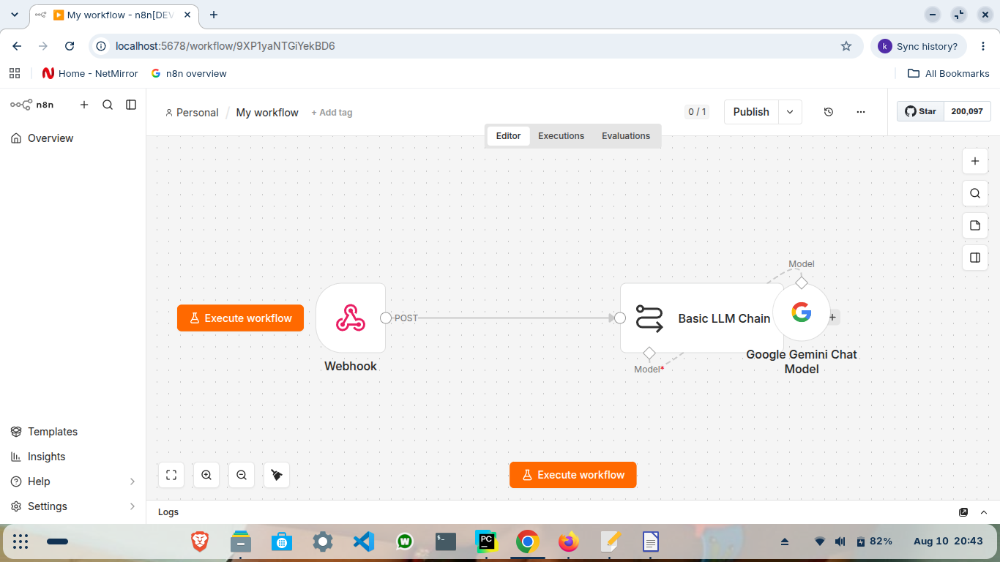
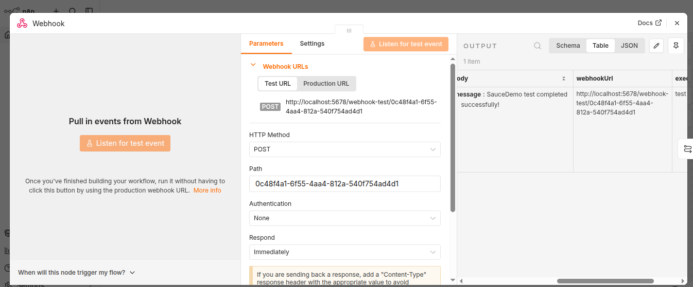
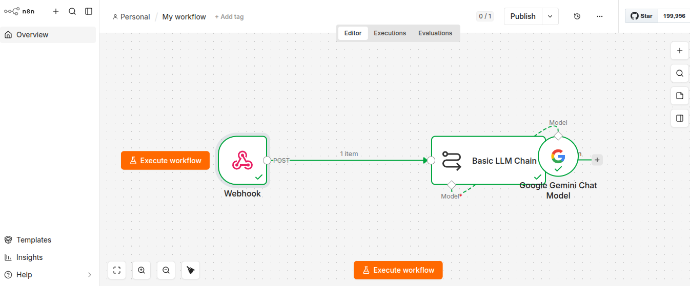

# n8n Workflow Automation

A working automation project demonstrating n8n workflow orchestration with Playwright, webhooks, AI agents, Google Sheets, Gmail, Jira, Google Gemini, and Ollama.

## 📑 Table of Contents

- [Project Overview](#project-overview)
- [Project Structure](#project-structure)
- [Workflows](#workflows)
- [Playwright and n8n Integration](#playwright-and-n8n-integration)
- [Project Evidence](#project-evidence)
- [Script Execution](#script-execution)
- [Execution Flow](#execution-flow)
- [SauceDemo and n8n Execution Evidence](#saucedemo-and-n8n-execution-evidence)
- [AI-QA Bug Triage](#ai-qa-bug-triage)
- [Email Automation](#email-automation)
- [Import Workflows](#import-workflows)
- [Security](#security)
- [Technology Stack](#technology-stack)
- [Project Takeaway](#project-takeaway)

## Project Overview

This project demonstrates practical workflow automation using n8n and its integration with automated testing and external services.

The project includes:

- Playwright E2E test integration
- n8n webhook integration
- AI-assisted workflow orchestration
- Google Gemini
- Ollama
- Google Sheets
- Gmail
- Jira
- Automated QA defect triage
- Test execution evidence
- Workflow execution evidence

## Project Structure

```text
n8n-automation/
├── workflows/
│   ├── My_workflow.json
│   ├── google_sheet_worklow.json
│   └── AI-QA-Automated-Bug-Triage.json
│
├── screenshots/
│   ├── n8n email workflow/
│   ├── n8n for create bugs in jira/
│   ├── n8n-myworkflow-saucedemo/
│   ├── n8nlocalserver.png
│   └── project_evidence.png
│
├── pages/
├── tests/
├── testData/
├── utilities/
├── conftest.py
├── pytest.ini
├── requirements.txt
└── README.md
```

## Workflows

### 1. Playwright Webhook and Gemini

[My Workflow](workflows/My_workflow.json)

- Webhook trigger
- Basic LLM Chain
- Google Gemini Chat Model
- Webhook-driven workflow processing
- Playwright integration

### 2. Google Sheets, Gmail and Jira AI Agent

[Google Sheets Workflow](workflows/google_sheet_worklow.json)

- Chat Trigger
- AI Agent
- Simple Memory
- Google Sheets
- Gmail
- Jira
- Google Gemini Chat Model
- AI-assisted workflow orchestration

### 3. AI-QA Automated Bug Triage

[AI-QA Automated Bug Triage](workflows/AI-QA-Automated-Bug-Triage.json)

- Chat Trigger
- AI Agent
- Ollama Chat Model
- Simple Memory
- Google Sheets
- Jira
- AI-assisted QA defect triage
- Jira issue creation

## Playwright and n8n Integration

The project integrates a Playwright SauceDemo E2E test with a local n8n webhook.

The integration demonstrates how an automated test execution can trigger downstream n8n workflow processing.

### Integration Components

- Playwright executes the SauceDemo E2E scenario.
- `tests/test_E2EScenario.py` contains the Playwright test and n8n webhook integration.
- The test sends a completion payload to the configured n8n webhook.
- n8n receives the webhook request.
- The configured n8n workflow processes the request.
- Workflow execution is verified through the n8n interface.

## Project Evidence

### Playwright and n8n Project Evidence


This screenshot provides evidence of the Playwright and n8n integration project environment and implementation.

### Local n8n Server


The project uses a local n8n instance for workflow development, configuration, testing, and execution.

## Script Execution

The main integrated Playwright test is:

```text
tests/test_E2EScenario.py
```

Run the test with:

```bash
pytest tests/test_E2EScenario.py -v
```

The test executes the SauceDemo E2E scenario and sends the configured test completion payload to the n8n webhook.

## Execution Flow

```text
Playwright SauceDemo E2E Test
        |
Test execution completed
        |
n8n Webhook receives payload
        |
n8n Workflow executes
        |
Downstream workflow processing
```

The integration demonstrates communication between UI test automation and an external workflow automation platform.

## SauceDemo and n8n Execution Evidence

### My Workflow



The n8n workflow configured for the Playwright integration.

### SauceDemo E2E Test Completed



Evidence of the SauceDemo E2E test completion.

### n8n Workflow Execution



Evidence of the n8n workflow execution after receiving the test event.

## AI-QA Bug Triage

The AI-QA workflow demonstrates automated QA defect processing using an AI agent with Google Sheets and Jira integration.

### AI-QA Automated Bug Triage


### AI Bug Triage Workflow


### Jira Issue Created by n8n


### Google Sheets Output


## Email Automation

The email workflow demonstrates AI-assisted email generation and automated Gmail processing.

### Email Workflow


### Chat Message


### Multiple Emails Sent


### Email Delivered


### Sent Email Verification


### Email Sent Successfully


### Additional Email Evidence


## Import Workflows

1. Open the local n8n instance:

```text
http://localhost:5678
```

2. Import the required workflow JSON from the `workflows/` directory.
3. Recreate the required OAuth and API credentials in the target n8n environment.
4. Configure the required webhook or service credentials.
5. Execute the workflow.
6. Verify the workflow nodes and outputs.

## Security

- Credentials and API secrets are not stored in the repository.
- n8n runtime data and SQLite databases are not committed.
- OAuth and API credentials must be recreated in the target environment.
- Local n8n runtime data remains outside the GitHub repository.

## Technology Stack

- n8n
- Python
- Pytest
- Playwright
- Webhooks
- Google Gemini
- Ollama
- Google Sheets
- Gmail
- Jira
- Git
- GitHub

## Project Takeaway

This project demonstrates practical integration between automated testing and workflow automation.

The project shows the ability to:

- Build and execute Playwright E2E tests
- Connect automated tests with n8n webhooks
- Build reusable n8n workflows
- Integrate AI models into workflow processing
- Automate QA defect triage
- Create Jira issues through workflow automation
- Process data through Google Sheets
- Automate Gmail workflows
- Validate workflow execution using execution evidence
- Integrate testing automation with external business workflows

The main technical takeaway is the ability to combine **Python, Playwright, Pytest, n8n, AI services, and business applications** into practical automation workflows.
