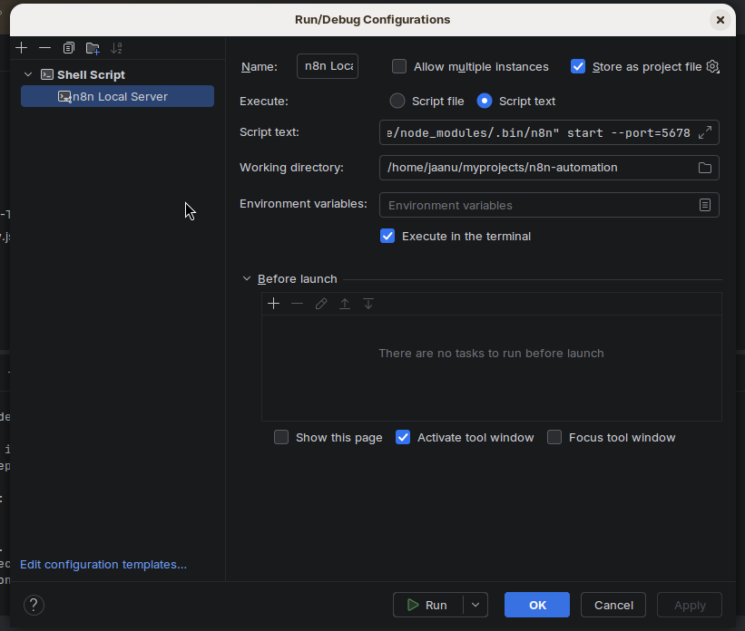
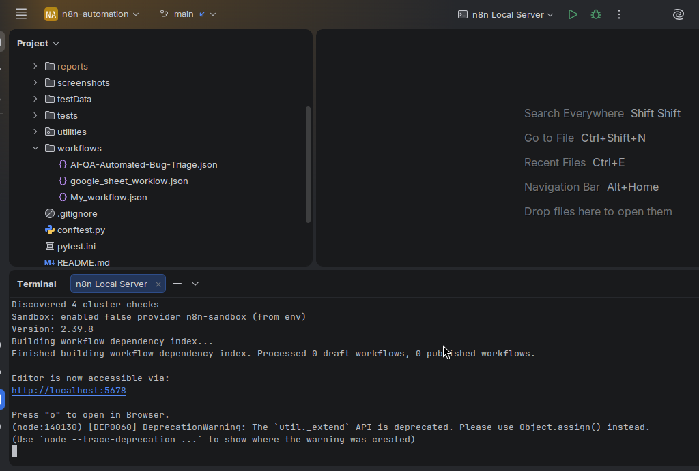
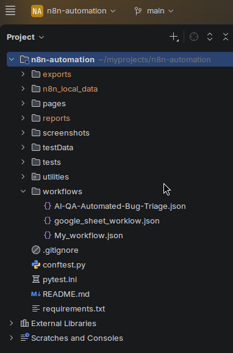
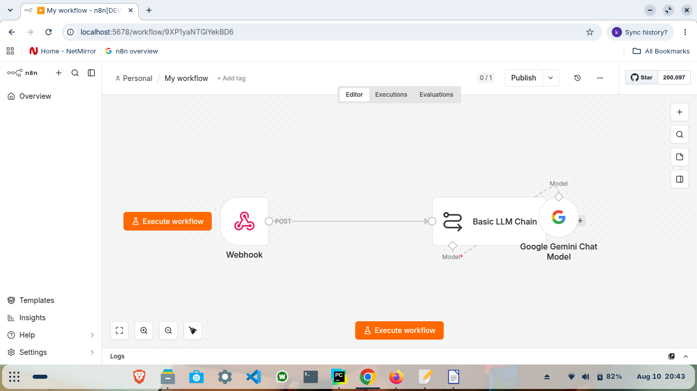
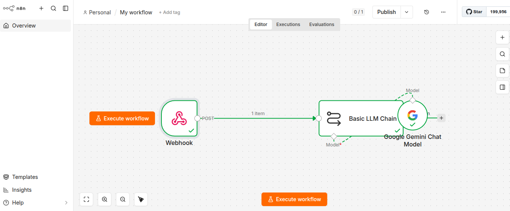
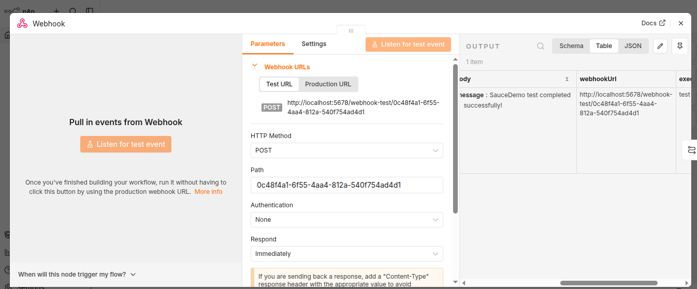

# n8n Workflow Automation

Practical n8n automation project demonstrating local n8n integration with PyCharm, Playwright SauceDemo automation, AI-assisted QA defect processing, Google Sheets, Gmail, Google Gemini, Ollama, Jira, and webhooks.

## Project Contents

1. n8n Integration
2. AI-QA Automated Bug Triage
3. Google Sheets, Gmail and AI Agent
4. My Workflow - SauceDemo

---

## 1. n8n Integration

This section documents the local n8n setup and its integration with the PyCharm automation project.

### 1.1 PyCharm n8n Local Server Configuration

The PyCharm Run Configuration is used to start the local n8n server from the project environment.



This configuration starts the local n8n server on port 5678.

### 1.2 Local n8n Server

The local n8n server is running successfully and the n8n editor is available through the browser.



The local n8n interface is available at:

```text
http://localhost:5678
```

### 1.3 PyCharm Project and n8n Workflows

The PyCharm project contains the Playwright automation framework and the n8n workflow definitions used in this project.



This project structure provides the environment used for the Playwright and n8n integration.

---

## 2. AI-QA Automated Bug Triage

This workflow demonstrates automated QA defect processing using an AI Agent, Ollama, Google Sheets, and Jira.

The workflow receives QA defect information, processes the information using the AI Agent, and creates the corresponding Jira issue.

Workflow file:

`workflows/AI-QA-Automated-Bug-Triage.json`

### 2.1 AI-QA Automated Bug Triage Workflow

The workflow contains the chat trigger, AI Agent, Ollama Chat Model, Simple Memory, Google Sheets, and Jira components.


This screenshot shows the complete workflow structure used for QA defect processing.

### 2.2 QA Defect Information in Google Sheets

The workflow uses QA defect information stored in Google Sheets as input for processing.


The defect records provide the information processed by the AI Agent.

### 2.3 AI-Assisted Defect Processing

The AI Agent processes the defect information and performs the configured QA automation actions.


This screenshot provides execution evidence for the automated defect-processing workflow.

### 2.4 Jira Issue Created by n8n

After processing the defect information, the workflow creates the corresponding Jira issue.


This screenshot provides evidence of the final Jira issue creation result.

---

## 3. Google Sheets, Gmail and AI Agent

This workflow demonstrates AI-assisted email automation using Google Sheets, Gmail, Google Gemini, and an AI Agent.

The workflow is executed directly from the n8n interface using a prompt message.

Workflow file:

`workflows/google_sheet_worklow.json`

### 3.1 Google Sheets, Gmail and AI Agent Workflow

The workflow connects the chat trigger, AI Agent, Google Gemini, Simple Memory, Google Sheets, and Gmail.


This screenshot shows the complete workflow structure used for spreadsheet-based email automation.

### 3.2 AI Agent Request

A user prompt is provided to the AI Agent to check information from the Google Sheet and perform the required email operation.


The prompt initiates the automated processing.

### 3.3 Automated Email Execution

The AI Agent processes the request and sends the generated email through Gmail.


This screenshot provides evidence that the Gmail operation was completed successfully.

### 3.4 Delivered Automated Email

The generated email is received in the target mailbox.


This confirms successful delivery of the automated email.

### 3.5 Multiple Email Processing

The workflow processes multiple records and generates the corresponding email messages.


This demonstrates repeated email processing through the workflow.

### 3.6 Ramya Email Verification

The workflow generates and delivers an automated email for the selected recipient.


This provides recipient-level verification of the workflow result.

### 3.7 Sam Email Verification

The workflow generates and delivers an automated email for the selected recipient.


This provides another recipient-level verification of automated email delivery.

### 3.8 Sneha Email Verification

The workflow generates and delivers an automated email for the selected recipient.


This provides additional verification of automated email delivery.

---

## 4. My Workflow - SauceDemo

This workflow demonstrates Playwright SauceDemo E2E automation integrated with an n8n webhook and Google Gemini.

The Playwright test is executed from the PyCharm project and sends the test completion information to the configured n8n webhook.

Workflow file:

`workflows/My_workflow.json`

### 4.1 SauceDemo n8n Webhook Workflow

The n8n workflow contains a Webhook connected to a Basic LLM Chain and Google Gemini Chat Model.



This screenshot shows the workflow structure responsible for receiving and processing the Playwright test completion request.

### 4.2 n8n Workflow Execution

The n8n workflow executes after receiving the webhook request from the Playwright test.



This provides evidence that the webhook-triggered n8n workflow executed successfully.

### 4.3 SauceDemo E2E Test Completion

The SauceDemo Playwright E2E test completes successfully as part of the PyCharm automation project.



The test can be executed with:

```bash
pytest tests/test_E2EScenario.py -v
```

This demonstrates the connection between the Playwright E2E test execution and the n8n webhook workflow.

---

## Workflow Definitions

The repository contains the following exported n8n workflow definitions:

`workflows/My_workflow.json`

`workflows/google_sheet_worklow.json`

`workflows/AI-QA-Automated-Bug-Triage.json`

---

## Technology Used

- n8n
- Python
- Pytest
- Playwright
- PyCharm
- Webhooks
- Google Gemini
- Ollama
- Google Sheets
- Gmail
- Jira

---

## Project Takeaway

This project demonstrates four practical automation areas:

- Local n8n integration with a PyCharm automation project
- AI-assisted QA defect processing and Jira issue creation
- Google Sheets and Gmail automation using an AI Agent
- Playwright SauceDemo E2E automation integrated with an n8n webhook

The repository contains the workflow definitions together with documented execution evidence for each automation area.
